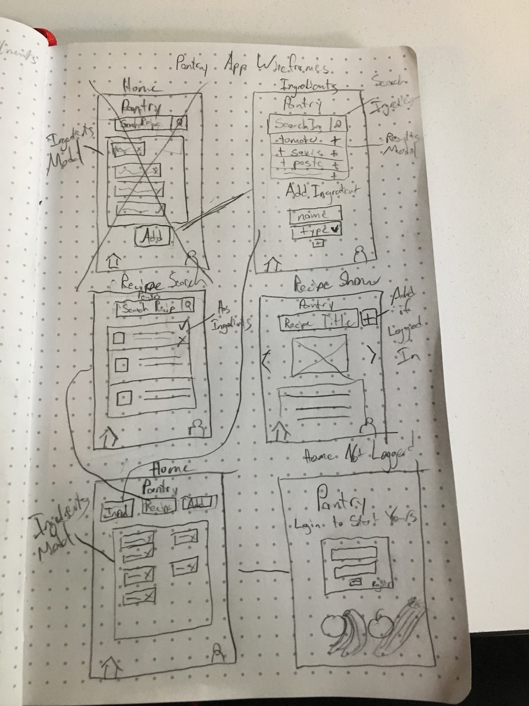
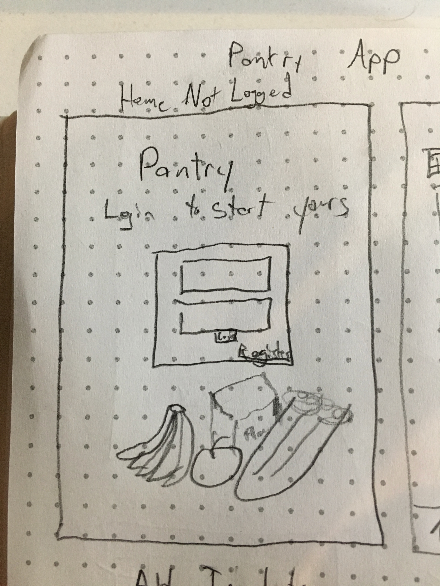
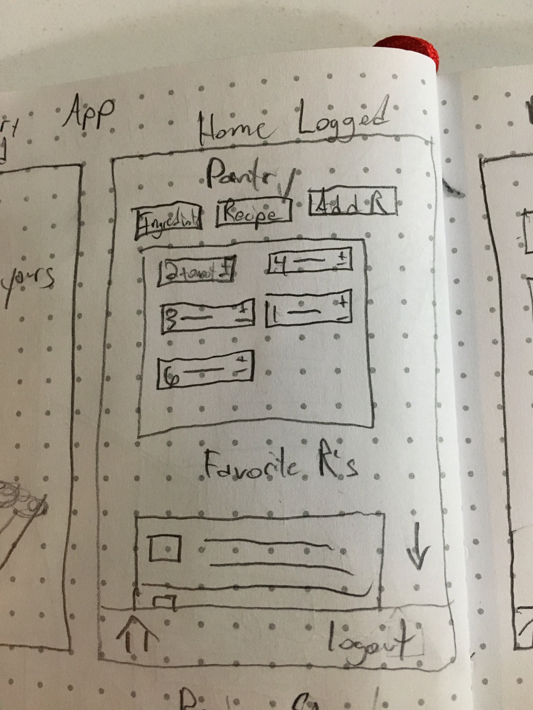
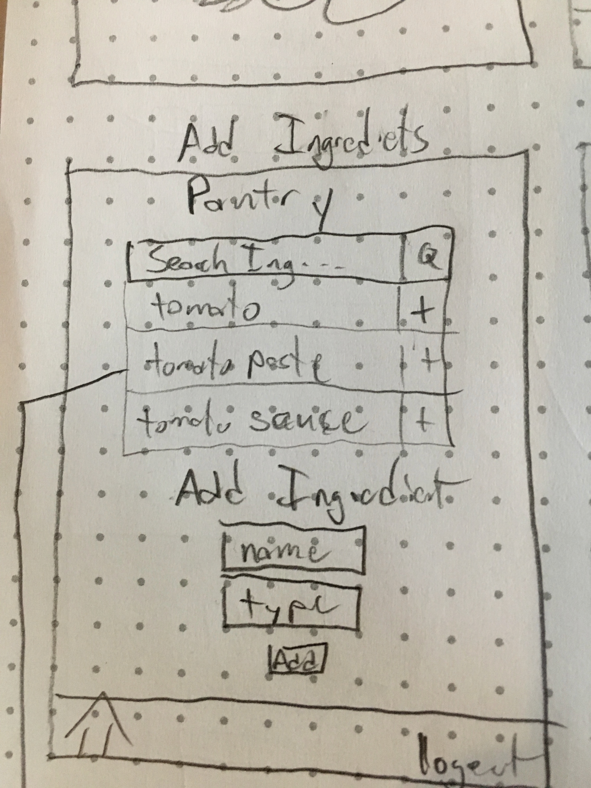
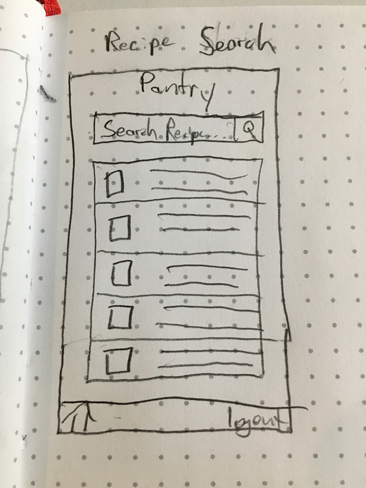
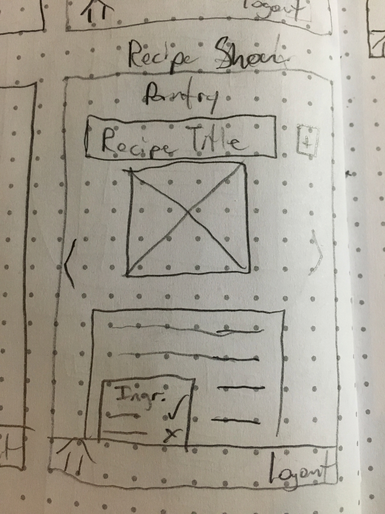

#Pantry App 

## User Stories

	User gets to the site and has not registered before:
		They see the app title and a prompt to login to get started
		They click the Register new user button, fill out the form and Register

	User get to the site and has registered before, but has not logged in:
		The user logs in on splash screen and is taken to the home page

	User has not added any ingredients to their pantry:
		User clicks ingredients button and is taken to the ingredients page
		User sees search bar at top of page
			User searches for ingredient and sees the one they want to add
			User adds ingredient to their pantry
			or
			User searches for ingredient and doesn't see the one they want to add
			User types out name and type of ingredient and hits add
			Ingredient is added to the ingredients database and user's pantry

	User is on the ingredients page and hits the home button after adding an ingredient to their pantry:
		The user is taken back to the home screen with the ingredient displaying in their pantry

	User is on the home screen and hits the search recipe button:
		User is taken to the recipe search page
		User writes a query and searches the recipe database
			On the backend:
			The food2fork api is queried on the backend and adds any recipes found to the database
			The app's recipe api is queried and return search results in a modal below the search bar
		Recipes are displayed priority given to recipes that the user has ingredients for
		User clicks on a recipe and is taken to the Recipe show Page

	User is on the recipe show page:
	User reads information about the recipe and decides to add it to their favorites
	User hits the add to favorites button and this recipe is saved to their profile

	User wants to add a new recipe:
	User hits the add recipe button from the home screen
	User enters information about the recipe in the various text fields
	The ingredients search modal from the ingredients page allows users to add ingredients to the recipe
	User hits submit and the recipe is added

## Wireframes
### Site Map

### Login

### Home

### Ingredients

### Search Recipe

### Show Recipe

## Endpoints

### User
Register a new user

Login

Logout

View User

#### Admin specific
Edit User 

Delete User

### Ingredients
View Ingredients (Pantry)

Add Ingredient

Delete Ingredient - use or spoilage

### Recipe
Search Recipe
	Search based on ingredients

Add Recipe

Edit Recipe

View Recipe

Delete Recipe

## Models

### User
		id: IntegerField()
		username: CharField()
		password: CharField()
		photo: CharField()

### Ingredient
		id: IntegerField(),
		name: CharField(),
		type: CharField(),
		expiration: DateField(),

### Recipe
		id: IntegerField(),
		title: CharField(),
		image_url: CharField(),
		source_url: CharField(),
		publisher: CharField(),
		publisher_url: CharField(),
		social_rank: CharField(),
		created_by: ForeignKeyField()

### Ingredient of User (Pantry)
		id: IntegerField(),
		ingedient_id: ForeignKeyField()
		user_id: ForeignKeyField()
		qty

### Ingredient in Recipe
		id: IntegerField(),
		recipe_id: ForeignKeyField()
		ingredient_id: ForeignKeyField()

### Recipe of User
		id: IntegerField(),
		user_id: ForeignKeyField()
		recipe_id: ForeignKeyField()
